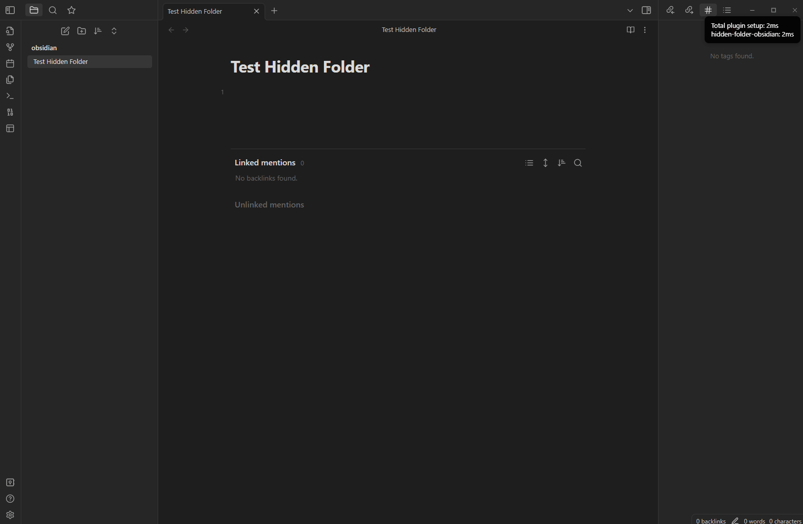

# Hidden Folder for Obsidian  

Hidden Folder in Obsidian:  

- Regular expression  
- Ribbon icon for enable or disable  
- Translation  

## Demo

  

# Example  

> `^folder1`

```txt
- folder1 <- match
  - folder1
  - folder2
- folder2
  - folder1
  - folder2
```

> `abc`

```txt
- folder1
  - folder1
    - subabcfolder1 <- match
  - folderabc2 <- match
- folder2
  - foldabcer1 <- match
  - folder2abc <- match
```

> `\/folder$`

```txt
- folder1
  - folder1
  - folder2
- folder2
  - folder1 <- match
  - folder2
```

> `\/?folder$`

```txt
- folder1 <- match
  - folder1
  - folder2
- folder2
  - folder1 <- match
  - folder2
```

> `folder1\/folder`

```txt
- folder1
  - folder1 <- match
  - folder2
- folder2
  - folder1
  - folder2
```
